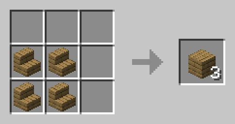
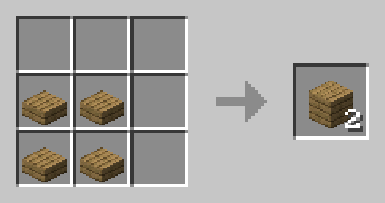
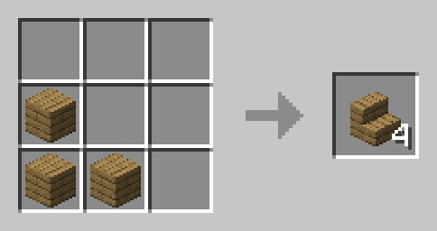
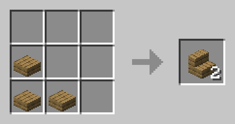
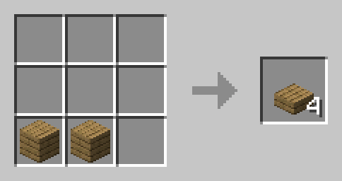
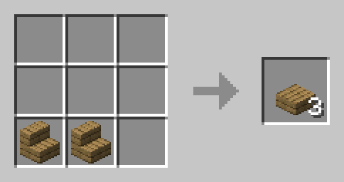
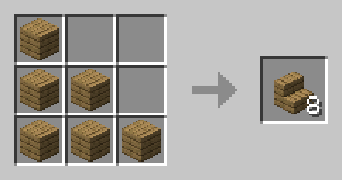
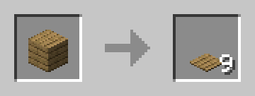

# Block, Paper, Scissors: Stairs & Slabs

## Minecraft Data Pack by TacoSocks

This data pack aims to make stairs and slabs less of a hassel by creating a cyclical relationship between blocks, stairs, and slabs, hence the "Block, Paper, Scissors" title, as well as making these recipes accessible for inventory crafting. This applies to all blocks with stair and slab variants:

- Craft any stair into its respective block or slab variant
- Craft any slab into its respective block or stair variants
- Add 2x2-crafting recipes for any block into its respective stair or slab variant.

---

## Version Compatibility

| Minecraft Version | Available? |
|:---:|:---:|
| `1.21` - `1.21.1` | Yes |
| pre-`1.21` | No, but maybe in future |

---

## Custom Crafting Recipes

This data pack creates each of the custom recipes below, with the notable advantage of being able to craft all of them in the 2x2 crafting area of the inventory.

| Ingredients | Crafting Recipe (2 x 2 \| 3 x 3) | Result |
|:---:|:---:|:---:|
| Any `4` `stairs` |  | `3` respective `blocks/planks` |
| Any `4` `slabs` |  | `2` respective `blocks/planks` |
| Any `3` `blocks/planks` |  | `4` respective `stairs` |
| Any `3` `slabs` |  | `2` respective `stairs` |
| Any `2` `blocks/planks` |  | `4` respective `slabs` |
| Any `2` `stairs` |  | `3` respective `slabs` |

---

## Overridden Vanilla Recipes

### Crafting

To match the balancing of this data pack, I updated the vanilla recipe for all stairs to yeild 8 instead of 4.

| Ingredients | Crafting Recipe (3 x 3) | Result |
|:---:|:---:|:---:|
| Any `6` `blocks/planks` |  | `8` respective `stairs` |

### Stonecutting

Because of my custom recipes for stairs, I had to change pressure plate crafting recipes to stonecutting recipes. I figured pressure plates aren't as common of a crafting recipe, but I had to make a way to still obtain them, so I settled on this. This applies to all blocks with a vanilla recipe for a pressure plate.

| Ingredients | Stonecutting Recipe | Result |
|:---:|:---:|:---:|
| Any `1` `block/planks` |  | `9` respective `pressure plates` |

---

## About

### Creator: `TacoSocks21`

- [YouTube](https://www.youtube.com/@TacoSocks21)

### Inspiration and References

- [Upgraded Stair Recipes](https://modrinth.com/datapack/upgraded-stair-recipes) data pack on Modrinth
    - Creators: [JacobA0225](https://modrinth.com/user/JacobA0225) and [Bumstronaut](https://modrinth.com/user/Bumstronaut)
- Vanilla Tweaks' [Crafting Tweaks](https://vanillatweaks.net/picker/crafting-tweaks/#) > "Back to Blocks"
